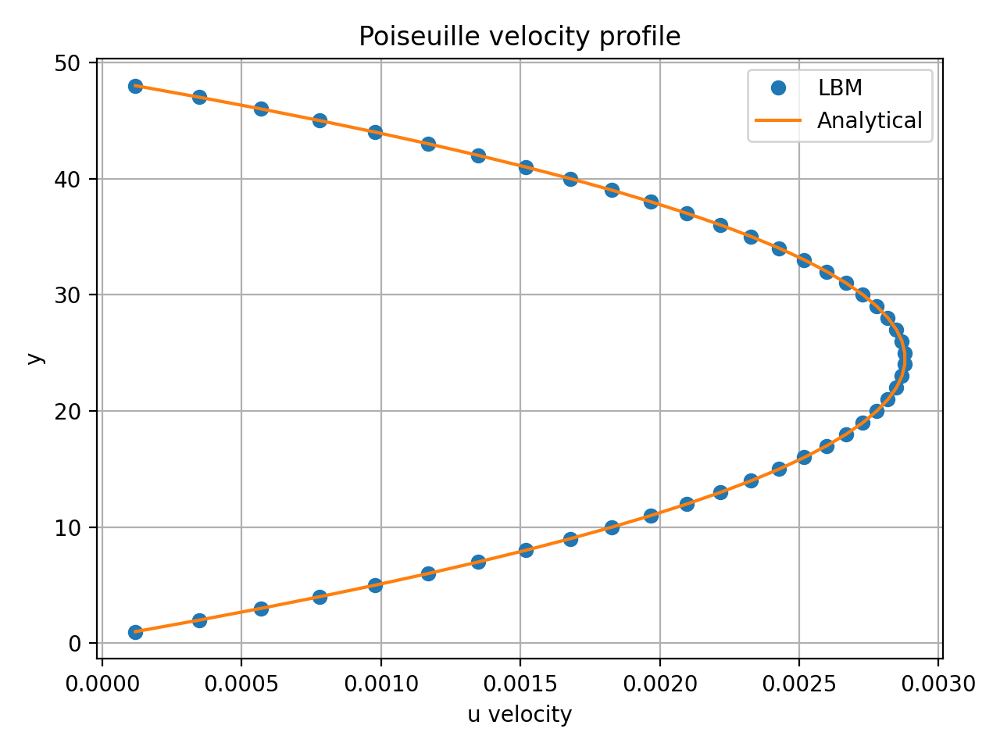
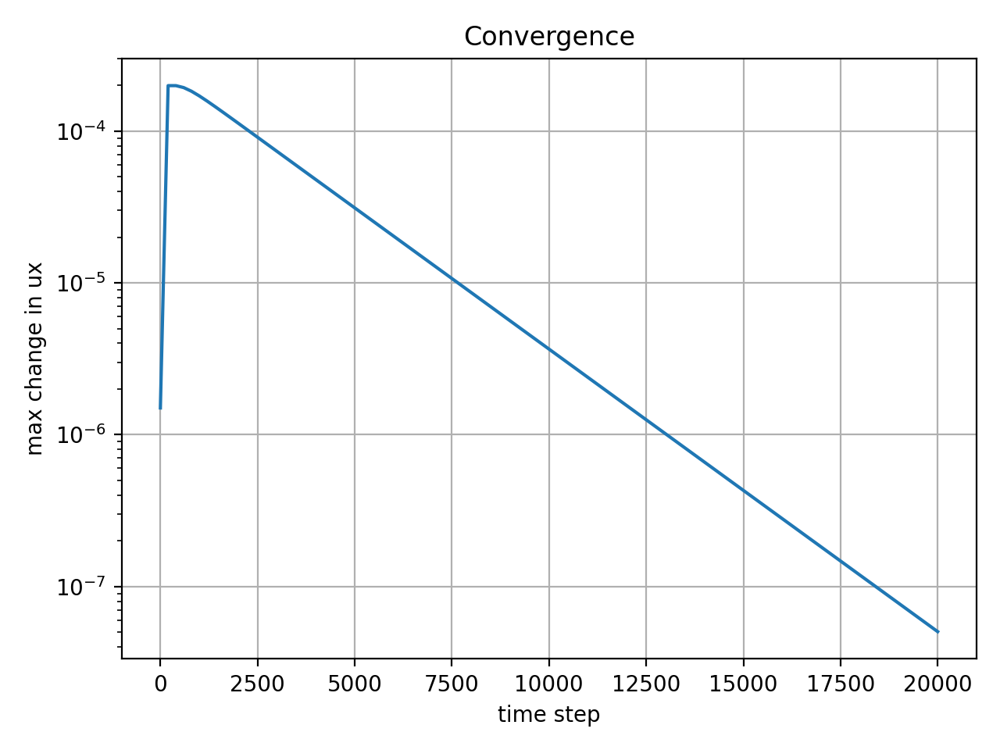

# LBM Poiseuille Flow Solver D2Q9 C++

<p align="center">
  
  
  
  <a href="https://kandil2001.github.io/">
    
  </a>
</p>

This repository contains my C++ implementation of the Lattice Boltzmann Method for 2D Poiseuille channel flow.

I built it as a small, readable CFD validation project. The case is useful because the analytical solution is known, so the numerical velocity profile can be compared directly with the expected parabolic profile.

<p align="center">
  
</p>

## Main features

- D2Q9 lattice Boltzmann solver written in C++
- BGK collision model
- Constant streamwise driving term
- Bounce-back boundary condition at the upper and lower walls
- Periodic channel direction
- Analytical Poiseuille profile comparison
- CSV output for post-processing
- Python plotting script for the validation and convergence figures
- Simple structure for learning and future extension

## Why this project

I made this project as a clean first step into the Lattice Boltzmann Method.

Instead of starting with a complicated geometry or a large CFD framework, I wanted a small solver where the main numerical steps are easy to follow. Poiseuille flow is a good first test because the final velocity profile should become a parabola.

The basic loop is:

```text
collide -> stream -> apply wall boundary conditions -> repeat
```

## How the solver works

At each lattice node, the D2Q9 model stores nine particle distribution functions. During every time step, the solver updates these distributions and reconstructs the macroscopic velocity field.

During the run:

1. Density and velocity are calculated.
2. The equilibrium distribution is evaluated.
3. The BGK collision step relaxes the solution toward equilibrium.
4. The streaming step moves the distributions to neighboring lattice nodes.
5. Bounce-back is applied at the solid walls.
6. The centerline velocity profile is compared with the analytical Poiseuille solution.

The top and bottom boundaries are no-slip walls. The left and right sides are periodic, representing a repeating channel section.

## Results from the current run

The uploaded example results were generated with:

```bash
./lbm_channel 160 50 20000 0.8 1e-6
```

The setup was:

| Parameter | Value |
|---|---:|
| `nx` | 160 |
| `ny` | 50 |
| `steps` | 20000 |
| `tau` | 0.8 |
| `viscosity` | 0.1 |
| `forceX` | 1e-6 |

The numerical result follows the expected parabolic velocity profile, which shows that the basic LBM algorithm is working correctly for this validation case.

<p align="center">
  
</p>

The convergence plot is useful for checking whether the solution has approached a steady state.

## Running the code

Build and run the solver with:

```bash
git clone https://github.com/Kandil2001/LBM_Poiseuille_D2Q9_CPP.git
cd LBM_Poiseuille_D2Q9_CPP
make
./lbm_channel
```

Run a custom case with:

```bash
./lbm_channel nx ny steps tau forceX
```

Example:

```bash
./lbm_channel 160 50 20000 0.8 1e-6
```

Generate the plots with:

```bash
pip install numpy matplotlib pandas
python3 scripts/plot_results.py
```

Clean the build and generated text/CSV outputs with:

```bash
make clean
```

## Repository structure

```text
include/lbm.hpp                  D2Q9 constants, weights, directions, and helpers
src/main.cpp                     main LBM solver
scripts/plot_results.py          plotting script
results/centerline_profile.csv   numerical and analytical velocity profile
results/velocity_field.csv       full velocity field output
results/convergence.csv          residual history
results/run_info.txt             run parameters
results/velocity_profile.png     velocity validation plot
results/convergence.png          convergence plot
Makefile                         build and clean commands
```

## Notes and limitations

This is an educational CFD project, not a production LBM code. The current version focuses on one simple validation case and keeps the implementation intentionally readable.

The results depend on the grid size, relaxation time, driving strength, and number of time steps. If the run is too short, the profile may not fully reach the steady solution.

Useful next steps include OpenMP parallelization, MPI domain decomposition, a grid convergence study, Reynolds number variation, and comparison with finite difference or finite volume solvers.

## Author

Ahmed Kandil — [Portfolio](https://kandil2001.github.io/) · [GitHub](https://github.com/Kandil2001) · [LinkedIn](https://www.linkedin.com/in/ahmed-kandil03/)
